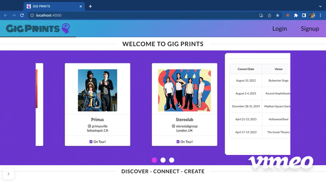

# GIG PRINTS

Welcome to Gig Prints- a single-page web application where touring bands and poster designers are two different types of users that can both discover and connect with each other to create unique concert posters for a band's upcoming tour dates as well as manage the tasks related to seeing a poster idea to completion.

> Please note all artwork, poster artist information, and band information are property of their rightful respective owner. Usage of band, poster artist, and poster images are for educational, non-commercial purposes only.

## Table of Contents
1. [Motivation](#Motivation)
2. [Demo](#Demo)
3. [Features](#Features)
4. [How To Use](#How-To-Use)
5. [Tech Stack & Requirements](#Tech-Stack-&-Requirements)
6. [Getting Started](#Getting-Started)

## Motivation
I am an avid concert-goer and poster collector, and prior to becoming a software engineer, I spent my entire working career in different facets of the live music industry. As soon as I arrive at a concert, the first thing I do is visit the merch stand, hoping there is a cool limited edition poster for sale. Most concerts I attend do not have a poster for sale, which is a huge missed opportunity for everyone involved: the independent poster designer, who would have a chance to share their artistic vision with a whole new audience, the band, who would add a new revenue stream, and the fans, who would be able to own a unique, tangible piece of that special concert experience forever.

I decided to build a real-world web application to help bands discover the best poster designers from all over the world, to facilitate poster designers in showcasing their work and easily connecting with bands on tour, and to simplify and centralize the process of creating concert posters so that more poster designers are booked for poster projects and more bands recognize the supply of talent that's available and feel compelled to respond to the demand by adding concert posters to their merch offerings.

## Demo
[Watch me demo the entire app here!](https://vimeo.com/798881890)

**Landing Page**



**Band Login / Band Home Page**


**Band Profile**


**My Projects**


**Designer Login / Designer Home Page**


**Designer Profile**


**Edit Profile**


## Features

* Secure authenticated & authorized signup/login/logout functionality for band and designer models using Rails bcrypt gem and sessions.
* Semantic UI React components for user profile pages, band and designer homepages which include browsing, filtering and search features, and an editable table for project and task management.
* CRUD actions for three models including a joiner, facilitated on the frontend and harnessed on the backend.
* Live search queries the database, which is developed from scratch for band and poster designer data.
* Carousel slideshow on Homepage showcasing site's main features.
* Custom backend routes and react-router client-side routes.

## How To Use

* Bands can update whether they are on tour or not, and poster designers can update whether they are open to work or not.
* Bands can filter out designers not open to work and designers can filter out bands who aren't touring.
* To post any upcoming tour dates with open poster commissions to their profiles, Bands can create a new poster project on the "My Projects" page, add the relevant details such as concert date, location, and deadline, and mark the project as "unassigned" (only poster projects marked as "unassigned" will POST to the "Open Poster Commissions" section of the band's profile).
* After a band and poster designer get in touch via email and mutually-agree to a poster project, the band can update the "unassigned" poster project to "in progress" on the "My Projects" page, set the agreed-upon poster designer from a dropdown menu of all poster designers using the app, and add any other details needed to create the poster (dimensions, edition, budget, etc). Once the status of a project is changed from "unassigned", it will be removed from the "Open Poster Commissions" section of the band's profile.
* After a band has assigned a poster designer to a poster project, the designer has the capability to upload image links as drafts until the band agrees to the final draft.
* After the band has agreed to the final image draft uploaded by the poster designer, they will mark the status of the project as "complete" and the completed poster will POST to both band and designer profiles under the "recent concert posters" section.
* Both Bands and Designers have the ability to edit their profiles and edit a poster project, but only bands can create a new project or delete a project.

## Tech Stack & Requirements

> **Languages:** JavaScript | Ruby | HTML5 | CSS

> **Frameworks:** React.js | Ruby on Rails

> **Libraries:** React Router | Semantic UI

- react 18.2.0
- react-router-dom 6.6.2
- semantic-ui-react 2.1.4
- ruby 2.7.4p191
- rails 7.0.4
- npm 8.19.2

## Getting Started

1. Install dependencies:
```sh
npm install
```

2. Start rails server: 
```sh
rails s
```

3. Start local react server: 
```sh
cd client
```
```sh
npm start
```